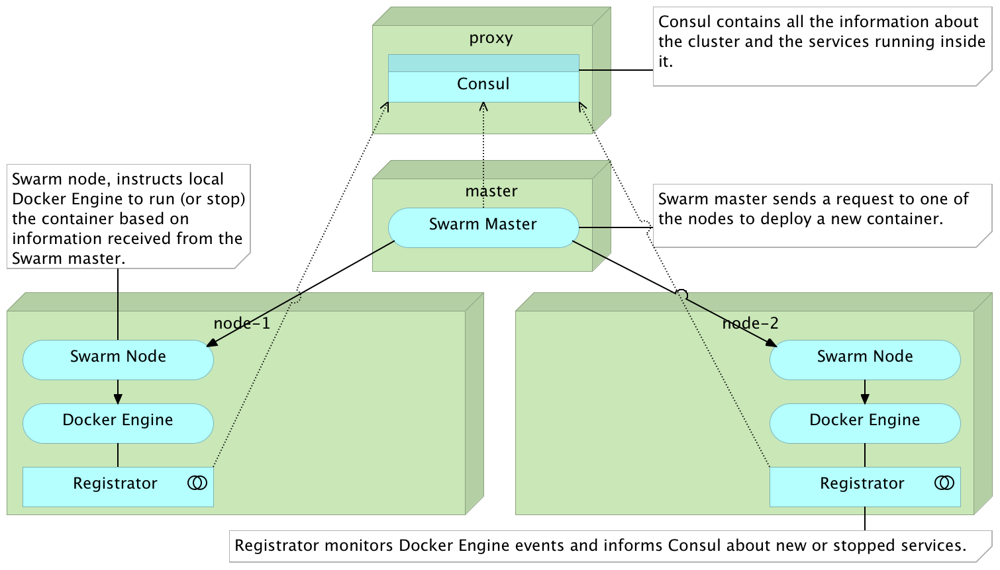
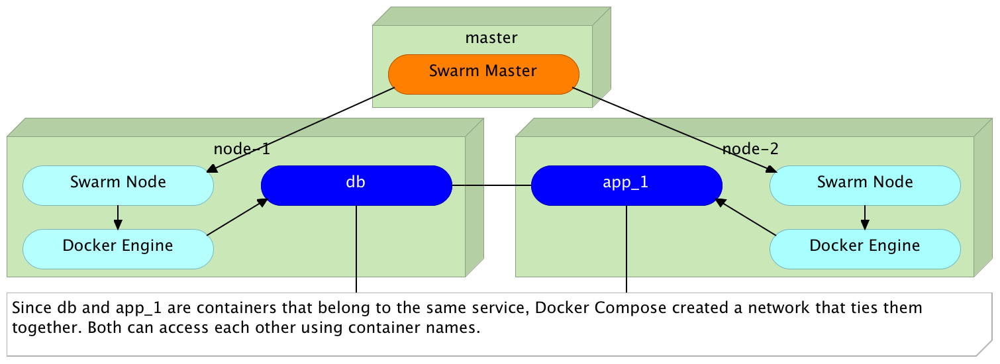
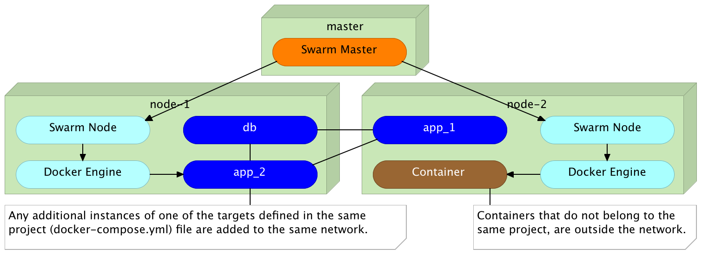
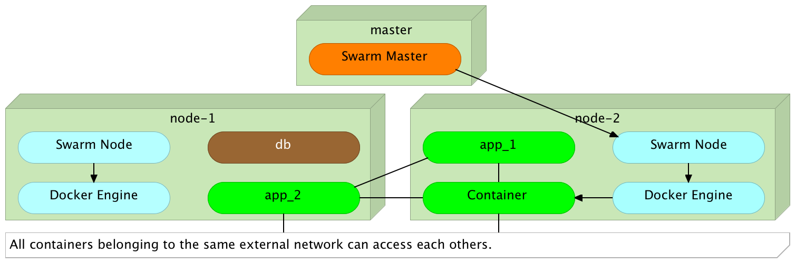
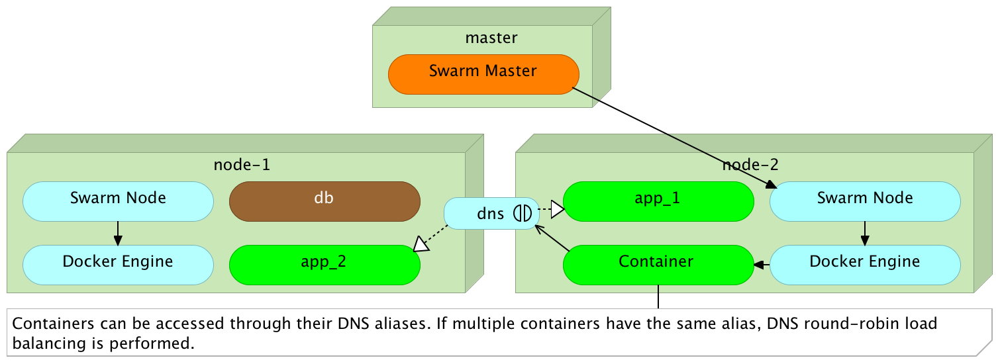
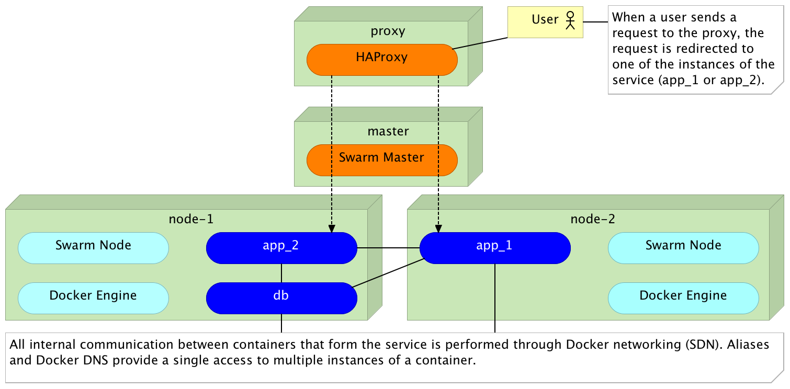

Docker Networking (SDN) and DNS: The Good, The Bad, And The Ugly
==========================================================

*Docker SDN* (*Software Defined Network*) already exists for quite some time. What is new, starting from the release 1.11, is the addition of *DNS round-robin load balancing*. That is both a reason for celebration and an opportunity to explore *Docker networking* and *DNS*. We'll explore internal and external networking, see how DNS fits into the picture, discuss use cases that might be a good fit, and finish with pros and cons.

Let's start from the beginning. Since I don't know whether you're a Mac, Windows, or Linux user, we'll create a few VMs running Ubuntu and use them to simulate a Docker Swarm cluster.

Setting Up The Cluster
----------------------

The only requirements for the examples that follow are [Vagrant](https://www.vagrantup.com/) and [Git](https://git-scm.com/). I chose Vagrant over [Docker Machine](https://www.docker.com/products/docker-machine) so that everyone can use the same commands no matter whether host OS is Linux, OS X, or Windows. The principles explained here are the same no matter how you setup your Docker hosts.

Please make sure that both Vagrant and Git are installed on your laptop. Everything else will be provisioned automatically.

Let's get going. The commands that will create and provision the VMs are as follows.

```bash
git clone https://github.com/vfarcic/docker-flow-proxy.git

cd docker-flow

vagrant plugin install vagrant-cachier

vagrant up swarm-master swarm-node-1 swarm-node-2 proxy
```

When the execution of the `vagrant up` command is finished, we'll have a commonly used Docker Swarm cluster configuration. The *proxy* node hosts *Consul* that will serve as service registry. At the moment, *proxy* service is missing (more on that later). The *swarm-master* server will host *Swarm* running in *master* mode. Finally, the two cluster nodes (*swarm-node-1* and *swarm-node-2*) are also running *Swarm* but, this time, in *node* mode. The cluster nodes also host *Registrator* that will make sure that all containers running in the cluster are registered in *Consul*. I won't go deeper into the explanation of the cluster setup but concentrate on Docker networking and DNS features.



Let us enter the *proxy* VM and start exploring different networking options.

```bash
vagrant ssh proxy

cd /vagrant/articles/dns
```

The *dns* directory contains all the code we'll need throughout this article.

Creating Docker Network Automatically
-------------------------------------

Let's see Docker networking in action. We'll run a simple service consisting of two containers. They are defined as targets `app` and `db` inside the [docker-compose-internal.yml](https://github.com/vfarcic/docker-flow-proxy/blob/master/articles/dns/docker-compose-internal.yml) file. Its content is as follows.

```yml
version: '2'

services:
  app:
    image: vfarcic/books-ms
    ports:
      - 8080
    environment:
      - DB_HOST=books-ms-db
    depends_on:
      - db

  db:
    container_name: books-ms-db
    image: mongo
    environment:
      - SERVICE_NAME=books-ms-db
```

This definition does not contain anything related to networking, so we'll skip the explanation and run the containers.

```bash
export DOCKER_HOST=tcp://swarm-master:2375

docker-compose \
    -f docker-compose-internal.yml \
    up -d app
```

We specified that the `DOCKER_HOST` variable should point to the Swarm master and run the Docker Compose target `app`. Since the definition of the `app` target states that it depends on `db`, the `books-ms-db` container was run as well.

The output of the `up` command is as follows.

```
Creating network "dns_default" with the default driver
...
Creating books-ms-db
...
Creating dns_app_1
```

Unless specified otherwise, Docker Compose always creates the *default* network for all containers belonging to a project. Unless specified with the `-p` argument, a project is equivalent to a directory Compose file reside in (in this case *dns*). Therefore, as seen from the output, Docker Compose created a new network called `dns_default`.

Let's confirm that the containers we just run are indeed inside the newly created network. We can, for example, try to ping the container *books-ms-db* from inside the container *dns_app_1*.

```bash
docker exec -it dns_app_1 ping -c 1 books-ms-db
```

The output of the `exec` command is as follows.

```
PING books-ms-db (10.0.0.2): 56 data bytes
64 bytes from 10.0.0.2: icmp_seq=0 ttl=64 time=0.055 ms
--- books-ms-db ping statistics ---
1 packets transmitted, 1 packets received, 0% packet loss
round-trip min/avg/max/stddev = 0.055/0.055/0.055/0.000 ms
```

We can see that both containers are inside the same network and that the IP `10.0.0.2` was assigned to *books-ms-db*. Since those two containers were deployed with Swarm, they are running inside different servers. We don't even know (without listing processes or querying Consul) where is each of those containers running. The point is that, in this case, we do not need to know the IP of the server where the container is running. As long as it belongs to the same network, it is accessible by its name.

We can invert the situation and ping the container `dns_app_1` from inside the container `books-ms-db`.

```bash
docker exec -it books-ms-db ping -c 1 dns_app_1
```



Let's see what would happen if we instruct Swarm to deploy an additional instance of the *app* target.

```bash
docker-compose -f docker-compose-internal.yml scale app=2
```

This time, we have the *app* target scaled to two instances, and we can repeat the ping commands for all containers.

```bash
docker exec -it dns_app_1 ping -c 1 dns_app_2

docker exec -it dns_app_2 ping -c 1 dns_app_1

docker exec -it dns_app_2 ping -c 1 books-ms-db
```

As expected, all three containers can be accessed from each other. Since they belong to the same project (the same Docker Compose file), Docker put all of them inside the same network and assigned a different IP to each. The result is the same no matter whether all containers are created at the same time or run later on.

What would happen if we run a new container that, this time, does not belong to the same Compose project?

```bash
docker run -it --rm alpine ping books-ms-db
```

The output of the `run` command is as follows.

```
ping: bad address 'books-ms-db'
```

Since we run a container that was not defined inside the same Docker Compose project, it was not added to the same network and, therefore, it could not access the other containers.



Does this mean that containers can communicate with each other only if they belong to the same Compose project?

Before we try to answer that question, let's destroy the containers and start over.

```bash
docker-compose \
    -f docker-compose-internal.yml \
    down
```

As a side note, when Docker Compose removes the last container inside a network, it removes that network as well.

Adding Containers To The External Network
-----------------------------------------

Another way to define networking is as external (when looking from Docker Compose point of view).

We can use the `docker network` command to create a new network and, later on, tell Compose that some containers should belong to it.

```bash
docker network create backend
```

Since the `DOCKER_HOST` variable still points to the IP and the port of *Swarm master*, the newly created network spans all cluster servers.

We can confirm that the `backend` network was indeed created by executing the command that follows.

```bash
docker network ls
```

The output of the `network` command should be similar to the one that follows.

```
NETWORK ID          NAME                DRIVER
cd2675aa63cf        backend             overlay
2f77d6dd68f7        swarm-node-1/bridge bridge
ce249d5e9344        swarm-node-1/host   host
f65bb111c121        swarm-node-1/none   null
59b0f8b1f82a        swarm-node-2/bridge bridge
021455cd81ae        swarm-node-2/host   host
bd944b062d59        swarm-node-2/none   null
```

As you can see, besides networks created during the Swarm setup, the *backend* is available as well. We can use it through Compose or by executing `docker run` command with the `--net` argument. The content of the [docker-compose.yml](https://github.com/vfarcic/docker-flow-proxy/blob/master/articles/dns/docker-compose.yml) file is as follows.

```yml
version: '2'

networks:
  be:
    external:
      name: backend

services:
  app:
    image: vfarcic/books-ms${BOOKS_MS_VERSION}
    ports:
      - 8080
    environment:
      - SERVICE_NAME=books-ms
      - DB_HOST=books-ms-db
    networks:
      default: {}
      be:
        aliases:
          - books-ms
    depends_on:
      - db

  db:
    container_name: books-ms-db
    image: mongo
    environment:
      - SERVICE_NAME=books-ms-db
```

This Compose file is almost the same as the one we used earlier. The only difference is the addition of `networks` sections.

We won't go into details of the whole definition but focus on `networks`. The first `networks` section (at the top) is internally called `be`. It is set to be `external` and is referring to the network `backend`. The internal name is the reference we'll use inside services. If a network is `external`, it means that it needs to be created manually outside *Docker Compose*. We already did that by executing the `docker network create backend`. Finally, the name of the network must be the same as the name we specified through the command.

The `networks` section represents the general definition of the network. By itself, it has no purpose until it is defined inside services. Therefore, we have the `be` network specified inside the `app` service. We'll explore `aliases` a bit later.

We'll start by bringing up two instances of the target `app`, and, with them, the `db` they depend on.

```bash
docker-compose up -d app

docker-compose scale app=2
```

As before, Docker Compose created a network for all the containers defined inside the *docker-compose.yml* file. However, we specified that the *app* target should belong to the *backend* network as well. As a result, we have containers *dns_app_1* and *dns_app_2* belonging to both, and *books-ms-db* being only inside the *dns_default* network. That, in itself, does not provide anything new. All three containers can "speak" with each other with or without the *backend* network.

Let's see what happens if we run a new container, but, this time, use the `--net` argument to specify that it should belong to the *backend* network.

```bash
docker run -it --rm --net backend alpine ping -c 1 dns_app_1

docker run -it --rm --net backend alpine ping -c 1 books-ms-db
```

The output of the two commands is as follows.

```
PING dns_app_1 (10.0.0.2): 56 data bytes

ping: bad address 'books-ms-db'
```

Since the *dns_app_1* belongs to the same network, ping was successful. On the other hand, the second ping failed since the `books-ms-db` container does not belong to the external network *backend*.



Do we want to send requests to a particular instance of the target (e.g. *dns_app_1*)?

Load Balancing Requests To Multiple Instances
---------------------------------------------

Sending requests to a specific instance of the target defies the purpose of scaling. We scale because we want to improve performance and provide failover in case one of the instances stops working. Therefore, we want requests to be load balanced between all instances of the target. We can do that easily with *DNS load balancing* and *aliases*.

If you go back to the [docker-compose.yml](https://github.com/vfarcic/docker-flow-proxy/blob/master/articles/dns/docker-compose.yml) file we used earlier, you'll notice that the *backend* network defined inside the *app* target has the *book-ms* alias. By sending a request to the alias instead to a particular container name, Docker will perform *round-robin load balancing* and redirect it to one of the instances.

As a way to test it, we'll send three pings to the *books-ms* alias.

```bash
docker run -it --rm --net backend alpine ping -c 1 books-ms

docker run -it --rm --net backend alpine ping -c 1 books-ms

docker run -it --rm --net backend alpine ping -c 1 books-ms
```

The combined output of the commands is as follows.

```
PING books-ms (10.0.1.3): 56 data bytes

PING books-ms (10.0.1.3): 56 data bytes

PING books-ms (10.0.1.2): 56 data bytes
```

The first two requests were sent to the instance with the IP *10.0.1.3* while the third one was sent to *10.0.1.2*. Docker alias simplified communication between different services. The choice which instance the request should be forwarded can be moved outside of the service that sends the request. All that service needs to know is that the destination service is accessible through the alias *books-ms*. Docker will make sure that it reaches one of the instances of that service. If in your case, the result might have been different. Don't despair. The explanation is coming a bit later.



Networking Use Cases
--------------------

When working with Docker and SDN (Software Defined Networking), some patterns emerge and we can observe different use cases.

Networks created automatically by Docker Compose should be utilized for internal communication between containers that form the same project or the same service. That is useful because those containers need to be able "speak" with each other. In our example, *app* target stores and retrieves data from the database running in the separate container. No one outside that network can access those containers. We can call this type *internal communication*.

On the other hand, the *app* target exposes an HTTP API. We need other services to be able to invoke it. For that reason, we created the second (external) network called *backend*. Since other services are not supposed to access each other's databases, they are excluded from the network. In other words, communication between different services is available only through their APIs. We can call this type *external communication*.

Allowing Public Access To Services
----------------------------------

Those who paid attention will notice that we didn't mention the third case. We did not explore ways to access services from outside the cluster. After all, in most cases, we want our services to be public. We want our users to be able to use them. The reason for this omission lies in the need to use different tools for this type of access. While it is technically possible and relatively easy to accomplish this use case with Docker DNS load balancing, the solution would be sub-optimum.

Proxy services like [HAProxy](http://www.haproxy.org/) and [nginx](https://www.nginx.com/) are battle tested solutions for load balancing, reverse proxy, and few other things. Large scale access to scaled services with potentially huge load might not be best served using methods we explored. On the other hand, continuous deployment promoted by containers require constant reconfiguration of those services together with service discovery that will provide necessary information about the cluster and everything running inside it. Dynamic proxy reconfiguration and service discovery are beyond the scope of this article, and there are plenty of tools that will allow you to build your own solution. We'll use one of those only as an example of the result we want to accomplish with a proxy.

Since we do not, yet, have a proxy, the service we experimented with is currently not available from the public network. We can confirm that by sending an HTTP request.

```bash
curl -I proxy/api/v1/books
```

The output of the `curl` command is as follows.

```
HTTP/1.0 503 Service Unavailable
Cache-Control: no-cache
Connection: close
Content-Type: text/html
```

As expected, we got *503 Service Unavailable* response.

We can easily change that by running a proxy and configuring it to perform load balancing among the two instances of the service. We'll run the *vfarcic/docker-flow-proxy* container defined in the [docker-compose-proxy.yml](https://github.com/vfarcic/docker-flow-proxy/blob/master/articles/dns/docker-compose-proxy.yml) file. The definition is as follows.

```
version: '2'

services:
  proxy:
    container_name: docker-flow-proxy
    image: vfarcic/docker-flow-proxy
    environment:
      CONSUL_ADDRESS: 10.100.198.200:8500
    ports:
      - 80:80
      - 443:443
      - 8080:8080
```

Part of the process that created the VMs was to run the proxy, so all we have to do to is reconfigure it to load balance requests to the *books-ms* service.

```bash
curl "proxy:8080/v1/docker-flow-proxy/reconfigure?serviceName=books-ms&servicePath=/api/v1/books"
```

Now that the proxy is configured, we can use it as a relay to our service.

```bash
curl -I proxy/api/v1/books
```

This output of the `curl` command is as follows.

```
HTTP/1.1 200 OK
Server: spray-can/1.3.1
Date: Sat, 23 Apr 2016 17:47:20 GMT
Access-Control-Allow-Origin: *
Content-Type: application/json; charset=UTF-8
Content-Length: 2
```

This time, the response is *200 OK* meaning that the service is indeed accessible through the proxy.

As the result of combining the proxy with Docker networking and DNS, we solved the public access to services, load balancing, and the internal communication between containers.



If you're interested in more details about the proxy we used, please read the [Docker Flow: Proxy – On-Demand HAProxy Service Discovery and Reconfiguration](https://technologyconversations.com/2016/03/21/docker-flow-proxy-on-demand-haproxy-service-discovery-and-reconfiguration/) article or jump directly to the [Docker Flow: Proxy](https://github.com/vfarcic/docker-flow-proxy) project.

The Good, The Bad, And The Ugly
-------------------------------

Let us, quickly, evaluate the practices and technology we explored in this article.


### The good (adopt now)

Docker networking exists for several versions, and it is stable. Operating containers inside a cluster was painful and complicated without it. Links could not span multiple containers without involving workarounds, tricks, and "witchcraft". It was the major milestone that made *Swarm* a viable and, in many cases, the best solution for running containers inside a cluster.

DNS round robin is very easy to define and use. Big thumbs up to Docker for this feature. It is great when we need to allow internal communication between different containers. Without it, Docker networking is truly useful only when there is a single instance of the destination service. With DNS, we can start contemplating the usage of Docker SDN on a larger scale.

### The bad (potentially useful but still in its infancy)

While the DNS resolver in Engine 1.11 will randomize records (i.e. return them in a different order at each request), most DNS resolvers will sort the records. As the result, round-robin will not truly work as expected. You saw the example when we made three pings through DNS to the destination target *app*. Even though no one else was accessing the service, the first two requests went to the first instance, while the third went to the second (in your case the order might have been different). True round-robin would make the first request to the first instance, the second request to the second instance, and the third request to the first instance again. The problem is not in the Docker's implementation but in DNS itself. While in many cases this deviation should not cause problems, there are, still, better solutions we can apply. On the upside, this addition is a very important milestone, and we are yet to see the improvements next releases will bring.

### The ugly (do not use it)

Docker's DNS combined with aliases has many uses, but public-facing load balancing of big traffic is not one of them. Do not be tempted to replace your proxy with it. HAProxy and nginx, just to name a few, are battle tested and proven to work well under almost any load. With health checks, reverse proxy, URL rewriting, and many other features, they are much more than simple round-robin load balancers. The challenge when using proxies is dynamic reconfiguration based on service discovery, but that does not diminish their value nor justifies the switch to Docker's DNS. On the other hand, proxies do not reduce the value we got in the release 1.11. It is one more tool in the toolbelt and it is our job to know when to use one over the other. Please read the [Docker Flow: Proxy – On-Demand HAProxy Service Discovery and Reconfiguration](https://technologyconversations.com/2016/03/21/docker-flow-proxy-on-demand-haproxy-service-discovery-and-reconfiguration/) article for more information. Even if you do not choose to use *Docker Flow: Proxy*, it provides an insight into what we expect from proxies inside a cluster full of containers.

The DevOps 2.0 Toolkit
======================

<a href="http://www.amazon.com/dp/B01BJ4V66M" rel="attachment wp-att-3017"></a>If you liked this article, you might be interested in [The DevOps 2.0 Toolkit: Automating the Continuous Deployment Pipeline with Containerized Microservices](http://www.amazon.com/dp/B01BJ4V66M) book. Among many other subjects, it explores Docker clustering and networking in much more detail.

The book is about different techniques that help us architect software in a better and more efficient way with *microservices* packed as *immutable containers*, *tested* and *deployed continuously* to servers that are *automatically provisioned* with *configuration management* tools. It's about fast, reliable and continuous deployments with *zero-downtime* and ability to *roll-back*. It's about *scaling* to any number of servers, the design of *self-healing systems* capable of recuperation from both hardware and software failures and about *centralized logging and monitoring* of the cluster.

In other words, this book envelops the whole *microservices development and deployment lifecycle* using some of the latest and greatest practices and tools. We'll use *Docker, Ansible, Ubuntu, Docker Swarm and Docker Compose, Consul, etcd, Registrator, confd, Jenkins, nginx*, and so on. We'll go through many practices and, even more, tools.

The book is available from Amazon ([Amazon.com](http://www.amazon.com/dp/B01BJ4V66M) and other worldwide sites) and [LeanPub](https://leanpub.com/the-devops-2-toolkit).
