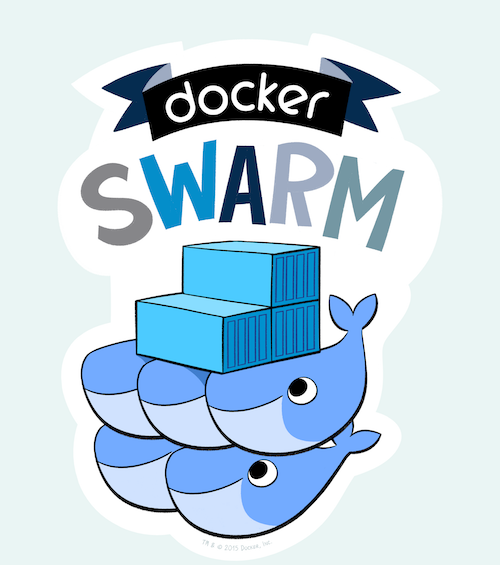
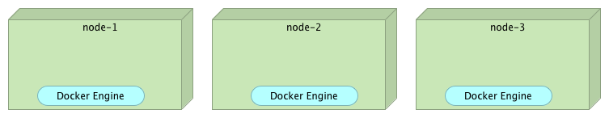
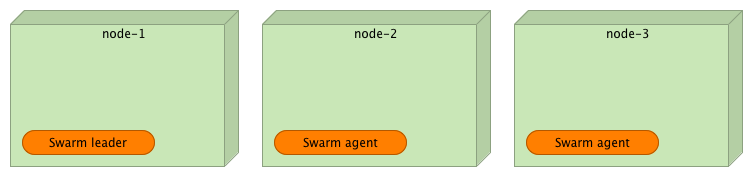
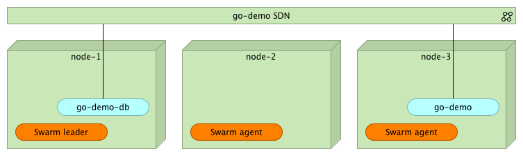
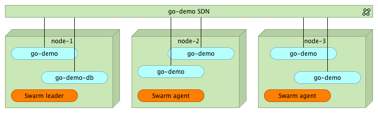

Tour Around Docker 1.12: Docker Swarm
=====================================



Docker just published a new Docker Engine v1.12. It is the most important release since v1.9. Back then, we got Docker networking that, finally, made containers ready for use in clusters. With v1.12, Docker is reinventing itself with a completely new approach to cluster orchestration. Say good bye to Swarm as a separate container that depends on an external data registry and please welcome the **new Docker Swarm**. Everything you'll need to manage your cluster is now incorporated into Docker Engine. Swarm is there. Service discovery is there. Improved networking is there.

The old Swarm (prior to Docker v1.12) used **fire-and-forget principle**. We would send a command to Swarm master and it would execute that command. For example, if we would send it something like `docker-compose scale go-demo=5`, the old Swarm would evaluate the current state of the cluster, discover that, for example, only one instance is currently running, and decide that it should run four more. Once such a decision is made, the old Swarm would send commands to Docker Engines. As a result, we would have five containers running inside the cluster. In order for all that to work, we were required to set up Swarm agents (as separate containers) on all the nodes that form the cluster and hook them into one of the supported data registries (Consul, etcd, and Zookeeper). The problem was that Swarm was executing commands we send it. It was not maintaining the desired state. We were, effectively, telling it what we want to happen (e.g. scale up), not the state we desired (make sure that five instances are running). Later on, the old Swarm got the feature that would reschedule containers from failed nodes. However, that feature had a few problems that prevented it from being a reliable solution (e.g. failed containers were not removed from the overlay network).

Now we got a brand new Swarm. It is part of Docker Engine (no need to run it as separate containers), it has incorporated service discovery (no need to set up Consul or whatever is your data registry of choice), it is designed from ground up to accept and maintain a desired state, and so on. It is a truly major change in how we deal with cluster orchestration.

In the past, I was inclined towards the old Swarm more than Kubernetes. However, that inclination was only slight. There were pros and cons for using either solution. Kubernetes had a few features Swarm was missing (e.g. the concept of the desired state), the old Swarm shined with it's simplicity and low usage of resources. With the new Swarm (the one that comes with v1.12), I have no more doubts which one to use. **The new Swarm is a better choice than Kubernetes**. It is part of Docker Engine so the whole setup is a single command that tells an engine to join the cluster. The new networking works like a charm. The bundle that can be used to define services can be created from Docker Compose files, so there is no need maintain two sets of configurations (Docker Compose for development and a different one for orchestration). Most importantly, the new Docker Swarm continues being simple to use. From the very beginning, Docker community pledged that they are committed to simplicity and, with this release, they, once again, proved that to be true.

And that's not all. The new release comes with a lot of other features that are not directly related with Swarm. However, the exploration of those features would require much more than one article. Therefore, today I'll focus on Swarm and leave the rest for one of the next articles.

Since I believe that code (or in this case commands), explain things better then words, we'll start with a demo of some of the new features introduced in version 1.12. Specifically, we'll explore the new command *service*.

Environment Setup
-----------------

The examples that follow assume that you have [Docker Machine](https://www.docker.com/products/docker-machine) version v0.8+ that includes [Docker Engine](https://www.docker.com/products/docker-engine) v1.12+. The easiest way to get them is through [Docker Toolbox](https://www.docker.com/products/docker-toolbox).

> If you are a Windows user, please run all the examples from *Git Bash* (installed through *Docker Toolbox*).

We'll start by creating three machines that will simulate a cluster.

```
docker-machine create -d virtualbox node-1

docker-machine create -d virtualbox node-2

docker-machine create -d virtualbox node-3

docker-machine ls
```

The output of the `ls` command is as follows.

```
NAME     ACTIVE   DRIVER       STATE     URL                         SWARM   DOCKER    ERRORS
node-1   -        virtualbox   Running   tcp://192.168.99.100:2376           v1.12.0
node-2   -        virtualbox   Running   tcp://192.168.99.101:2376           v1.12.0
node-3   -        virtualbox   Running   tcp://192.168.99.102:2376           v1.12.0
```

Please note that Docker version **MUST** be 1.12 or higher. If it isn't, please update your Docker Machine version, destroy the VMs, and start over.



With the machines up and running we can proceed and setup the Swarm cluster.

```bash
eval $(docker-machine env node-1)

docker swarm init --listen-addr $(docker-machine ip node-1):2377
```

The first command set environment variables so that local Docker Engine is pointing to the *node-1*. The second initialized Swarm on that machine. Right now, our Swarm cluster consists of only one VM.

Let's add the other two nodes to the cluster.

```bash
eval $(docker-machine env node-2)

docker swarm join $(docker-machine ip node-1):2377

eval $(docker-machine env node-3)

docker swarm join $(docker-machine ip node-1):2377
```

The other two machines joined the cluster as agents. We can confirm that by sending the `node ls` command to the *Leader* node (*node-1*).

```bash
eval $(docker-machine env node-1)

docker node ls
```

The output of the `node ls` command is as follows.

```
ID                           HOSTNAME  MEMBERSHIP  STATUS  AVAILABILITY  MANAGER STATUS
92ho364xtsdaq2u0189tna8oj *  node-1    Accepted    Ready   Active        Leader
c2tykql7a2zd8tj0b88geu45i    node-2    Accepted    Ready   Active
ejsjwyw5y92560179pk5drid4    node-3    Accepted    Ready   Active
```

The star tells us which node we can currently using. The *manager status* indicates that *node-1* is the *leader*.



In production environment we would probably set more than one node to be a leader and, thus, avoid deployment downtime if one of them fails. For the purpose of this demo, having one leader should suffice.

Deploying Container To The Cluster
----------------------------------

Before we deploy a demo service, we should create a new network so that all containers that constitute the service can communicate with each other no matter on which nodes they are deployed.

```bash
docker network create --driver overlay go-demo
```

We can check the status of all networks with the command that follows.

```bash
docker network ls
```

The output of the `network ls` command is as follows.

```
NETWORK ID          NAME                DRIVER              SCOPE
e263fb34287a        bridge              bridge              local
c5b60cff0f83        docker_gwbridge     bridge              local
8d3gs95h5c5q        go-demo             overlay             swarm
4d0719f20d24        host                host                local
eafx9zd0czuu        ingress             overlay             swarm
81d392ce8717        none                null                local
```

As you can see, we have two networks that have the *swarm* scope. The one named *ingress* was created by default when we set up the cluster. The second (*go-demo*) was created with the `network create` command. We'll assign all containers that constitute the *go-demo* service to that network.


The *go-demo* service requires two containers. Data will be stored in MongoDB. The back-end that uses that DB is defined as *vfarcic/go-demo* container.

Let's start by deploying the *mongo* container somewhere within the cluster. Normally, we'd use constraints to specify the requirements for the container (e.g. HD type, the amount of memory and CPU, and so on). We'll skip that and, simply, tell Swarm to deploy it anywhere within the cluster.

```bash
docker service create --name go-demo-db \
  -p 27017 \
  --network go-demo \
  mongo
```

The `-p` argument sets the port to *27017*. Please note that, when it contains only a single value, the port will be reachable only through networks the container belongs to. In this case, we set network to be *go-demo* (the one we created earlier). As you can see, the way we use `service create` is similar to the Docker `run` command you are probably already used to.

We can list all the running services.

```bash
docker service ls
```

Depending on how much time passed between `service create` and `service ls` commands, you'll see value of the *Replicas* column being zero or one. Immediately after creating the service, the value should be *0/1*, meaning that there are zero replicas running and the objective is to have one. Once the *mongo* image is downloaded and the container is running, the value should change to *1/1*.

The final output of the `service ls` command should be as follows.

```
ID            NAME        REPLICAS  IMAGE  COMMAND
c8tjeq1hofjp  go-demo-db  1/1       mongo
```

If we need more information about the *go-demo-db* service, we can run the `service inspect` command.

```bash
docker service inspect go-demo-db
```

Now that the database is running, we can deploy the *go-demo* container.

```bash
docker service create --name go-demo \
  -p 8080 \
  -e DB=go-demo-db \
  --network go-demo \
  vfarcic/go-demo
```

There's nothing new about that command. Internally, it exposes port 8080 and it belongs to the network *go-demo*. The environment variable *DB* is an internal requirement of the *go-demo* service that tells the code the address of the database.

At this point, we have two containers (*mongo* and *go-demo*) running inside the cluster and communicating with each other through the *go-demo* network. Please note that none of them is (yet) accessible from outside the network. At this point, your users do not have access to the service API. We'll discuss this in more details in the next article. Until then, I'll give you only a hint: *you need a proxy* capable of utilizing the new Swarm networking.



What happens if we want to scale one of the containers?

Scaling Services
----------------

We can, for example, tell Swarm that we want to run five replicas of the *go-demo* service.

```bash
docker service update --replicas 5 go-demo
```

With the `service update` command we scheduled five replicas. After a short period of time, Swarm will make sure that five instances of go-demo are running somewhere inside the cluster.

We can confirm that, indeed, five replicas are running through the, already familiar, `service ls` command.

```bash
docker service ls
```

The output is as follows.

```
ID            NAME        REPLICAS  IMAGE            COMMAND
1hzeaz2jxs5e  go-demo     5/5       vfarcic/go-demo
c8tjeq1hofjp  go-demo-db  1/1       mongo
```

As we can see, five out of five replicas of the *go-demo* container are running.

The `service tasks` command provides more detailed information about a single service.

```bash
docker service tasks go-demo
```

The output is as follows.

```
ID                         NAME       SERVICE  IMAGE            LAST STATE          DESIRED STATE  NODE
a88mn3nyk94rewpmumf8on6z6  go-demo.1  go-demo  vfarcic/go-demo  Running 59 minutes  Running        node-3
71x73ng63vi2w1408ld0miz43  go-demo.2  go-demo  vfarcic/go-demo  Running 4 minutes   Running        node-2
22lyubpnt8mt9wtjkvd6bmgdj  go-demo.3  go-demo  vfarcic/go-demo  Running 4 minutes   Running        node-2
b7689aieyfdrea8lbvecn8gzl  go-demo.4  go-demo  vfarcic/go-demo  Running 4 minutes   Running        node-1
7p6yt3rrxn7d5tssqr3ln9aye  go-demo.5  go-demo  vfarcic/go-demo  Running 4 minutes   Running        node-3
```

We can see that the *go-demo* service is running five instances distributed across the three nodes. Since they all belong to the same *go-demo* network, they can communicate with each other no matter where they run inside the cluster. At the same time, none of them is accessible from "outside".



What happens if one of the containers is stopped or if the whole node fails? After all, processes and nodes do fail sooner or later. Nothing is perfect and we need to be prepared for such situations.

Failover
--------

Fortunately, failover strategies are part of Docker Swarm. Remember, when we execute a `service` command, we are not telling Swarm what to do but the state we desire. In turn, Swarm will do it's best to maintain the specified state no matter what happens.

In order to test a failure scenario, we'll destroy one of the nodes.

```bash
docker-machine rm -f node-3
```

Swarm needs a bit of time until it detects that the node is down. Once it does, it will reschedule containers. We can monitor the situation through the `service tasks` command.

```bash
docker service tasks go-demo
```

The output (after rescheduling) is as follows.

```bash
ID                         NAME       SERVICE  IMAGE            LAST STATE              DESIRED STATE  NODE
7l8hrsov8hl7lehn3eggyqsgq  go-demo.1  go-demo  vfarcic/go-demo  Running About a minute  Running        node-1
71x73ng63vi2w1408ld0miz43  go-demo.2  go-demo  vfarcic/go-demo  Running About an hour   Running        node-2
22lyubpnt8mt9wtjkvd6bmgdj  go-demo.3  go-demo  vfarcic/go-demo  Running About an hour   Running        node-2
b7689aieyfdrea8lbvecn8gzl  go-demo.4  go-demo  vfarcic/go-demo  Running About an hour   Running        node-1
9lwwl4up0j3u1aiz6ut5fcgk8  go-demo.5  go-demo  vfarcic/go-demo  Running About a minute  Running        node-2
```

As you can see, after a short period of time, Swarm rescheduled containers among healthy nodes (*node-1* and *node-2*). If, your output still shows that some instances are running on the *node-3*, please wait for a few moments and repeat the `service tasks` command.

What Now?
---------

This concludes the exploration of basic concepts of the new Swarm features we got with Docker v1.12. Is this everything there is to know to successfully run a Swarm cluster? Not even close! What we explored by now is only the beginning. There are quite a few questions to waiting to be answered. How do we expose our services to public? How do we deploy new releases without downtime? Are there any additional tools we should use? I'll try to give answers to those and quite a few other questions in future articles. The next one will be dedicated to exploration of the ways we can expose our services to the public. We'll try to integrate a proxy with a Swarm cluster.
