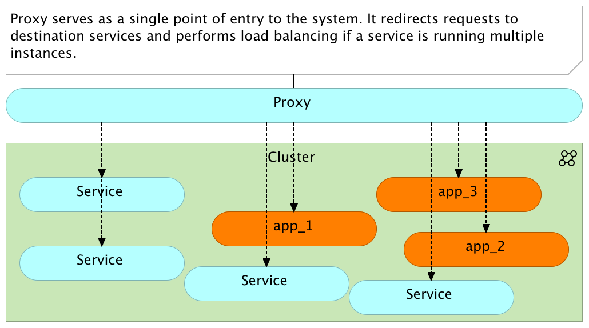
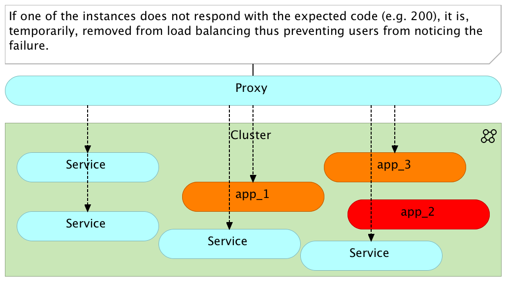

Proxy services are integral part of any system architecture that scales beyond a single server. In this article I will focus on failover strategies and skip all the other benefits proxies provide.

A simple setup would have a single proxy that routes all requests to our applications and services. It serves as a single entry point to the system and performs load balancing when a service is running multiple instances.



Please notice that the diagram demonstrates load balancing over three instances of the *app* service (*app_1*, *app_2*, and *app_3*).

Important part of each proxy are checks. We can configure it to perform checks and, if one service does not respond, remove it from load balancing. As a result, if one of the instances does not respond with the expected code (e.g. 200), it is, temporarily, removed from load balancing thus preventing users from noticing the failure. The same check will be repeated and, if the instance comes back online, it will be added to the list of those that are load balanced.



Proxies do not fix the root cause of failed instances but give us to to remedy the problem. Since failing instance is removed from load balancing queues, the worst thing that can happen is that your users experience slower response times (after all, there are fewer instances running) while some other (hopefully automated) process instantiates a new instance or brings the failing one back online.

The problem with proxies is that they represent a single point of failure. A single point of failure (SPOF) is a part of a system that, if it fails, will stop the entire system from working. If the proxy fails, the whole system is inaccessible.

We can run two instances of the proxy and set them up in a way that one takes over in case the other becomes unavailable. The discussion how to do that is beyond the scope of this article so I'll only give you a clue. In case of HAProxy, Google *Heartbeat* and *Keepalived*.

What I do want to discuss is how to recuperate failed proxy instance (no matter whether you're running one or multiple).

Before the emergence of cloud hosting, microservices, clustering, and what so not, the situation was relatively simple. We knew where will the application be deployed and which ports they will expose. As a result, proxy configurations were, more or less, static. They might change once in a while, but, since the change frequency was low, we could store the configurations in our repository knowing that it can be recuperated at any time.

Now, each new release or scaling of a service mean that we need to reconfigure our proxy. We change its configuration and reload it. Such changes can happen once a week, once a day, or multiple times a day. It all depends on how many times you deploy or scale your services. If that configuration is persisted on disk. If a proxy process dies, we just need to start it again. It will pick up the same configuration and start over. The problem is that proxies rarely fail for no reason. When they do, it is, more often than not, due to hardware problems. In such a case, you might need to move to a different server and might not be able to recuperate the configuration from the failed node.

Do I hear backup? We'll, unless you backup proxy configurations every time they change which, due to possibly high frequency of change is not a good idea, backups might not contain all the information proxy had before it crashed. Discarded!

How about distributed key/value stores like [Zookeeper](https://zookeeper.apache.org/), [etcd](https://github.com/coreos/etcd), or [Consul](https://www.consul.io/). They can, most of the time, guarantee that the information is stored across the cluster or even across multiple clusters. If we can store proxy configuration or, even better, elements of the configuration, those tools can provide a safe and secure way to restore the data we need. Since those tools propagate the information across all their instances, as long as one node with, let's say, Consul is running, our data is safe. Unlike traditional databases, they do not suffer from performance problems (assuming that we don't exaggerate with the amount of information we feed them). We can easily run one Consul instance on each cluster node without noticing any degradation in hardware usage.

Equipped with that idea, and armed with scripts and templates I used to accomplish this objective in the past, I decided to add such a feature to the [Docker Flow: Proxy](https://github.com/vfarcic/docker-flow-proxy) project.

Let's see it in action.

Docker Flow: Proxy - Failover Example
-------------------------------------

Please note that we'll use Vagrant to create simulated environments. Please consult the [Docker Flow: Proxy project](https://github.com/vfarcic/docker-flow-proxy) if you prefer examples with *Docker Machine*. It's worth noting that the examples in the [project README](https://github.com/vfarcic/docker-flow-proxy) are limited and with less description than what you'll find in this article.

```bash
# Setup Proxy

docker-machine create -d virtualbox proxy

export DOCKER_IP=$(docker-machine ip proxy)

export CONSUL_IP=$(docker-machine ip proxy)

eval $(docker-machine env proxy)

docker-compose up -d consul-server registrator proxy

curl $DOCKER_IP:8500/v1/health/service/consul?pretty

# Setup Services

docker-machine create -d virtualbox services

export DOCKER_IP=$(docker-machine ip services)

export CONSUL_IP=$(docker-machine ip services)

export CONSUL_SERVER_IP=$(docker-machine ip proxy)

eval $(docker-machine env services)

docker-compose up -d consul-agent registrator

curl $DOCKER_IP:8500/v1/health/service/consul?pretty

curl $DOCKER_IP:8500/v1/catalog/nodes

# Run a service

docker-compose \
    -f docker-compose-demo2.yml \
    -p go-demo \
    up -d db app

export PROXY_IP=$(docker-machine ip proxy)

curl "$PROXY_IP:8080/v1/docker-flow-proxy/reconfigure?serviceName=go-demo&servicePath=/demo"

curl -i $PROXY_IP/demo/hello

docker-compose \
    -f docker-compose-demo2.yml \
    -p go-demo \
    scale app=3

curl "$PROXY_IP:8080/v1/docker-flow-proxy/reconfigure?serviceName=go-demo&servicePath=/demo"

curl -i $PROXY_IP/demo/hello # Repeat

docker-compose \
    -f docker-compose-demo2.yml \
    -p go-demo \
    logs app

# TODO: Check that go-demo is registered in both Consul instances
# curl swarm-master:8500/v1/catalog/service/go-demo

# Proxy service failover

eval $(docker-machine env proxy)

docker-compose stop proxy

docker-compose rm -f proxy

curl -i $PROXY_IP/demo/hello

docker-compose up -d proxy

curl -i $PROXY_IP/demo/hello

# Proxy node failover

docker-machine rm -f proxy

export CONSUL_IP=$(docker-machine ip services)

export PROXY_IP=$(docker-machine ip services)

eval $(docker-machine env services)

docker-compose up -d proxy

curl -i $PROXY_IP/demo/hello
```


TODO
----

* Remove 1.0-beta