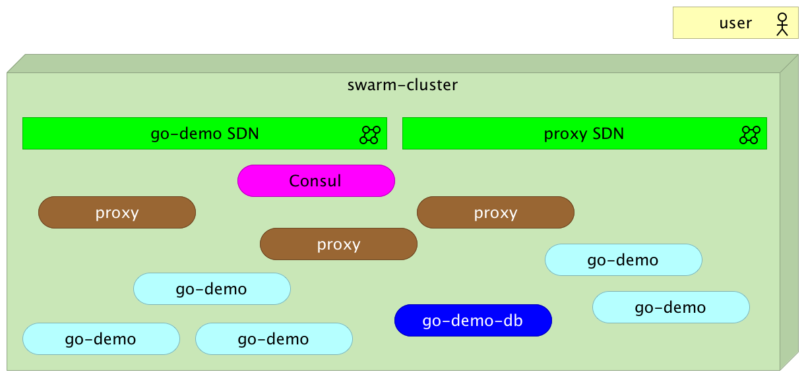
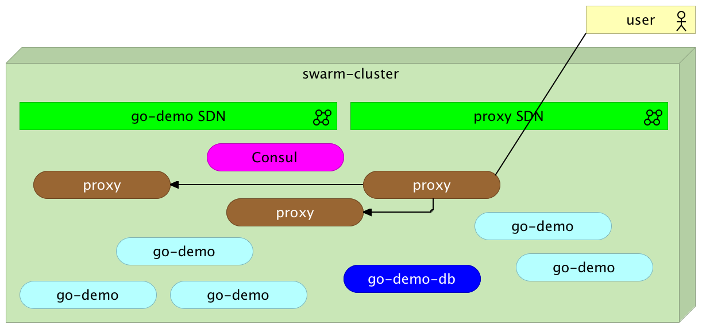
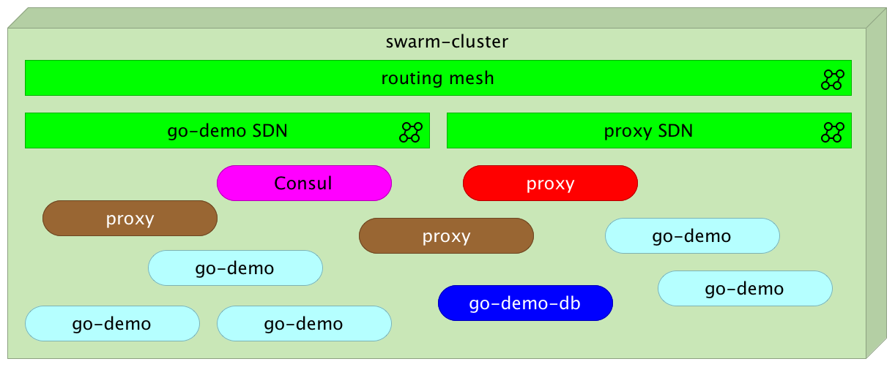
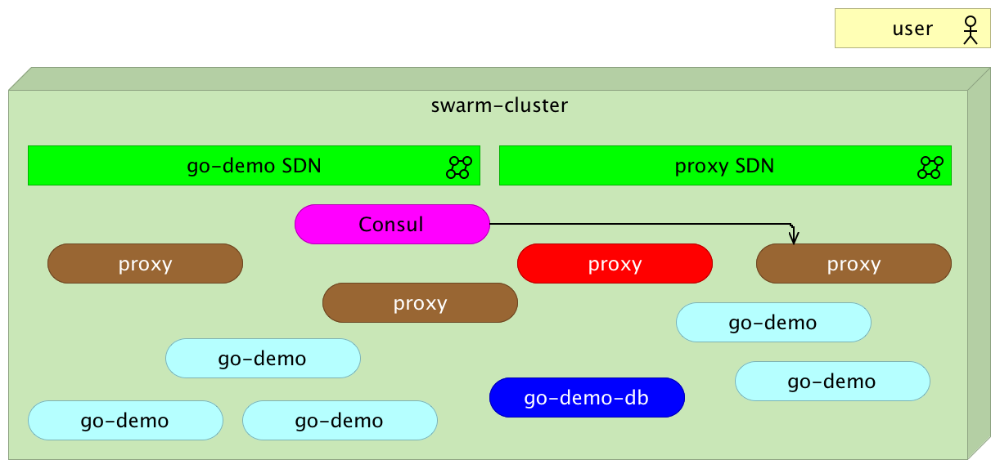
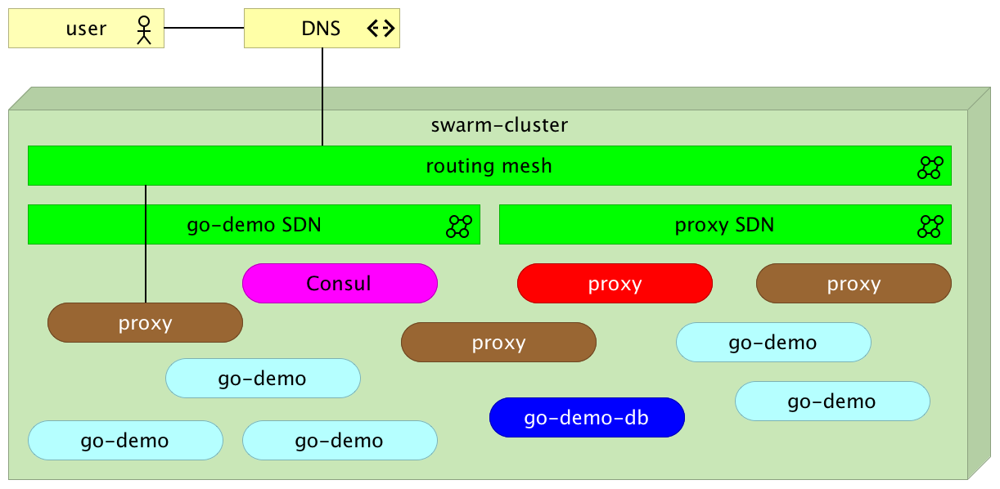

# Docker Flow: Proxy - Swarm Mode (Docker 1.12+) With Manual Configuration

* [Examples](#examples)

  * [Setup](#setup)
  * [Reconfiguring the Proxy](#reconfiguring-the-proxy)
  * [Removing a Service From the Proxy](#removing-a-service-from-the-proxy)
  * [Scaling the Proxy](#scaling-the-proxy)

* [The Flow Explained](#the-flow-explained)
* [Usage](../README.md#usage)

*Docker Flow: Proxy* running in the *swarm* mode is designed to leverage the features introduced in Docker v1.12. If you are looking for a proxy solution that would work with older Docker versions, please explore the [Docker Flow: Proxy - Standard Mode](standard-mode.md) article.

## Examples

The examples that follow assume that you have Docker Machine version v0.8+ that includes Docker Engine v1.12+. The easiest way to get them is through [Docker Toolbox](https://www.docker.com/products/docker-toolbox).

> If you are a Windows user, please run all the examples from *Git Bash* (installed through *Docker Toolbox*).

Please note that *Docker Flow: Proxy* is not limited to *Docker Machine*. We're using it as an easy way to create a cluster.

### Setup

To setup an example environment using Docker Machine, please run the commands that follow.

```bash
git clone https://github.com/vfarcic/docker-flow-proxy.git

cd docker-flow-proxy

chmod +x scripts/swarm-cluster.sh

scripts/swarm-cluster.sh
```

Right now we have three machines running (*node-1*, *node-2*, and *node-3*). Each of those machines runs Docker Engine. Together, they form a Swarm cluster. Docker Engine running in the first node (*node-1*) is the leader.

We can see the cluster status by running the following command.

```bash
eval $(docker-machine env node-1)

docker node ls
```

We'll skip a detailed explanation of the Swarm cluster that is incorporated into Docker Engine 1.12. If you're new to it, please read [Docker Swarm Introduction](https://technologyconversations.com/2016/07/29/docker-swarm-introduction-tour-around-docker-1-12-series/). The rest of this article will assume that you have, at least, basic Docker 1.12+ knowledge.

Now we're ready to deploy a service.

### Reconfiguring the Proxy

We'll start by creating two networks.

```bash
docker network create --driver overlay proxy

docker network create --driver overlay go-demo
```

The first (*proxy*) will be dedicated to the proxy container and services that should be exposed through it. The second (*go-demo*) is the network used for communications between containers that constitute the *go-demo* service.

Let's deploy the demo service. It consists of two containers; *mongo* is the database and *vfarcic/go-demo* is the actual service that uses it. They will communicate with each other through the *go-demo* network. Since we want to expose only *vfarcic/go-demo* to the "outside" world and keep the database "private", only the *vfarcic/go-demo* container will attach itself to the *proxy* network.

```bash
docker service create --name go-demo-db \
  --network go-demo \
  mongo
```

We can see the status of the service by executing the `service ls` command. Please wait until it has replicas set to *1/1*.

```bash
docker service ls
```

Let's run up the second service.

```bash
docker service create --name go-demo \
  -e DB=go-demo-db \
  --network go-demo \
  --network proxy \
  vfarcic/go-demo
```

Please wait until it has replicas set to *1/1*.

The details of the *go-demo* service are irrelevant for this exercise. What matters is that it was deployed somewhere inside the cluster and that it does not have any port exposed outside of the networks *go-demo* and *proxy*.

The only thing missing now is to reconfigure the proxy so that our newly deployed service is accessible on a standard HTTP port *80*. That is the problem *Docker Flow: Proxy* is solving.

```bash
docker service create --name proxy \
    -p 80:80 \
    -p 443:443 \
    -p 8080:8080 \
    --network proxy \
    -e MODE=swarm \
    vfarcic/docker-flow-proxy
```

We opened ports *80* and *443*. External requests will be routed through them towards the destination services. The third port (*8080*) will be used to send requests to the proxy specifying what it should do. The proxy it belongs to the *proxy* network and has the mode set to *swarm*.

As before, please use the `docker service ls` command to check that the container is running (replicas set to 1/1) before proceeding with the rest of the article.

Now that the proxy is running, we can tell it to include the *go-demo* service in its configuration.

```bash
curl "$(docker-machine ip node-1):8080/v1/docker-flow-proxy/reconfigure?serviceName=go-demo&servicePath=/demo&port=8080"
```

That's it. All we had to do is send an HTTP request to `reconfigure` the proxy. The `serviceName` query contains the name of the service we want to integrate with the proxy. The `servicePath` is the unique URL that identifies the service. Finally, the `port` should match the internal port of the service. Please note that it does not matter which server we hit with the request. The routing mesh will make sure that it is redirected to the destination container.

The output of the reconfigure request is as follows (formatted for better readability).

```json
{
  "Status": "OK",
  "Message": "",
  "ServiceName": "go-demo",
  "ServiceColor": "",
  "ServicePath": [
    "/demo"
  ],
  "ServiceDomain": "",
  "ConsulTemplateFePath": "",
  "ConsulTemplateBePath": "",
  "PathType": "",
  "SkipCheck": false,
  "Mode": "swarm",
  "Port": "8080"
}
```

*Docker Flow: Proxy* responded saying that reconfiguration of the service *go-demo* running on the path */demo* was performed successfully.

Let's see whether the service is indeed accessible through the proxy.

```bash
curl -i $(docker-machine ip node-1)/demo/hello
```

The output of the `curl` command is as follows.

```bash
HTTP/1.1 200 OK
Date: Thu, 07 Jul 2016 23:14:47 GMT
Content-Length: 14
Content-Type: text/plain; charset=utf-8

hello, world!
```

The response is *200 OK*, meaning that our service is indeed accessible through the proxy. All we had to do is tell *docker-flow-proxy* the name of the service.

Since *Docker Flow: Proxy* uses new networking features added to Docker 1.12, it redirects all requests to the internally created SDN. As a result, Docker takes care of load balancing, so there is no need to reconfigure the proxy every time a new instance is deployed. We can confirm that by creating a few additional replicas.

```bash
docker service update --replicas 5 go-demo

curl -i $(docker-machine ip node-1)/demo/hello
```

Feel free to repeat this request a few more times. Once done, check the logs of any of the replicas and you'll notice that it received approximately one-fifth of the requests. No matter how many instances are running and with which frequency they change, swarm network will make sure that requests are load balanced across all currently running instances.

*Docker Flow: Proxy* reconfiguration is not limited to a single *service path*. Multiple values can be divided by comma (*,*). For example, our service might expose multiple versions of the API. In such a case, an example reconfiguration request could be as follows.

```bash
curl "$(docker-machine ip node-1):8080/v1/docker-flow-proxy/reconfigure?serviceName=go-demo&servicePath=/demo/hello,/demo/person&port=8080"
```

The result from the `curl` request is the reconfiguration of the *HAProxy* so that the *go-demo* service can be accessed through both the */demo/hello* and the */demo/person* paths.

Optionally, *serviceDomain* can be used as well. If specified, the proxy will allow access only to requests coming from that domain. The example that follows sets *serviceDomain* to *my-domain.com*. After the proxy is reconfigured, only requests for that domain will be redirected to the destination service.

```bash
curl "$(docker-machine ip node-1):8080/v1/docker-flow-proxy/reconfigure?serviceName=go-demo&servicePath=/demo&serviceDomain=my-domain.com&port=8080"
```

For a more detailed example, please read the [Integrating Proxy With Docker Swarm](https://technologyconversations.com/2016/08/01/integrating-proxy-with-docker-swarm-tour-around-docker-1-12-series/) article.

### Removing a Service From the Proxy

We can as easily remove a service from the *Docker Flow: Proxy*. An example that removes the service *go-demo* is as follows.

```bash
curl "$(docker-machine ip node-1):8080/v1/docker-flow-proxy/remove?serviceName=go-demo"
```

From this moment on, the service *go-demo* is not available through the proxy.

### Scaling the Proxy

Swarm is continuously monitoring containers health. If one of them fails, it will be redeployed to one of the nodes. If a whole node fails, Swarm will recreate all the containers that were running on that node. The ability to monitor containers health and make sure that they are (almost) always running is not enough. There is a brief period between the moment an instance fails until Swarm detects that and instantiate a new one. If we want to get close to zero-downtime systems, we must scale our services to at least two instances running on different nodes. That way, while we're waiting for one instance to recuperate from a failure, the others can take over its load. Even that is not enough. We need to make sure that the state of the failed instance is recuperated.

Let's see how *Docker Flow: Proxy* behaves when scaled.

We'll start by removing the proxy service and instantiating it a bit differently this time.

```bash
docker service rm proxy
```

We need to accomplish two properties. The first one is the ability to store data in a way that each new instance can retrieve it. We'll use [Consul](https://www.consul.io/) to that purpose. It is a lightweight distributed key/value store.

```bash
export DOCKER_IP=$(docker-machine ip node-1)

docker-compose up -d consul-server
```

Please ignore *the Docker Engine you're using is running in swarm mode* warning.

It is worth noting that, in this case, we are running a single Consul instance. In production, we should have multiple (at least three). That way, if one Consul instance fails, data is not lost.

Now that Consul is running, we can instantiate *Docker Flow: Proxy*.

```bash
docker service create --name proxy \
    -p 80:80 \
    -p 443:443 \
    -p 8080:8080 \
    --network proxy \
    -e MODE=swarm \
    --replicas 3 \
    -e CONSUL_ADDRESS=$(docker-machine ip node-1):8500 \
    vfarcic/docker-flow-proxy
```

The major difference is that, this time, we used the `--replicas` argument to specify that three instances should run inside the Swarm cluster. The second difference is the environment variable `CONSUL_ADDRESS`. Proxy will use it to store its data.



> Please note that we should run multiple Consul instances in production. In such a case, please use the `CONSUL_ADDRESS` environment variable to set all addresses separated with comma (*,*). An example would be `-e CONSUL_ADDRESS=$(docker-machine ip node-1):8500,$(docker-machine ip node-2):8500,$(docker-machine ip node-3):8500`.

We should wait for a few moments until all three instances are running. The status can be seen by executing the `service ps` command.

```bash
docker service ps proxy
```

Let's reconfigure the proxy with the *go-demo* service.

```bash
curl "$(docker-machine ip node-1):8080/v1/docker-flow-proxy/reconfigure?serviceName=go-demo&servicePath=/demo&port=8080&distribute=true"
```

Please note that the request we just sent contains an additional query parameter `distribute`. When set to `true`, the proxy will discover the IPs of all its instances and update them. That way, no matter how many instances are running, all will have the same configuration.



It is assumed that the name of the service (`--name` argument) is set to `proxy`. If you prefer to name the service differently, please make sure that the environment variable `SERVICE_NAME` is set as well (e.g. `-e SERVICE_NAME=my-other-proxy`).

To test whether the reconfigure request was indeed re-sent to all the instances, we can send a couple of requests to the *go-demo* service.

```bash
# Please run the command that follows a couple of times

curl -i $(docker-machine ip node-1)/demo/hello
```

Since Docker's networking routing mesh is doing load balancing, each of those requests is sent to a different instance. Each request returned status *200 OK* proving that the parameter `distribute` indeed worked. All three instances of the proxy were reconfigured.

Now that we have three proxy instances running (and synchronized), we can test how the system behaves if one of them fails. We'll remove one of the instances and observe what happens.

```bash
eval $(docker service ps proxy | \
    tail -n 1 | \
    awk '{print "docker-machine ssh "$4" docker rm -f "$2"."$1}')
```

I won't go into details of the command we just run but only say that it removed one of the instances of the proxy.

> I haven't had time to test the command in Windows. Please let me know if you experience any problems.



We can see the result with the `service ps` command.

```bash
docker service ps proxy
```

The output is as follows.

```
ID                         NAME         IMAGE                      NODE    DESIRED STATE  CURRENT STATE           ERROR
b0k8xtc7cga636fymwl6nxmno  proxy.1      vfarcic/docker-flow-proxy  node-2  Running        Running 16 minutes ago
8figu4vrgn11vngzhv7k5pnmr  proxy.2      vfarcic/docker-flow-proxy  node-1  Running        Running 16 minutes ago
8tkfthhk8v6wjwol7u5fbmqjb  proxy.3      vfarcic/docker-flow-proxy  node-2  Running        Running 3 minutes ago
2neh3skl5pb8npk05i61q35h9   \_ proxy.3  vfarcic/docker-flow-proxy  node-2  Shutdown       Failed 3 minutes ago    "task: non-zero exit (137)"
```

Docker Swarm detected that one of the instances failed and created a new one.


Since the proxy is connected to Consul, the new instance consulted it and retrieved all the configurations we created so far. In other words, even though it is a new instance, it continued where the old stopped.



Feel free to run the *go-demo* request a couple of times and confirm that the new instance indeed has all the configuration.

```bash
# Please run the command that follows a couple of times

curl -i $(docker-machine ip node-1)/demo/hello
```

To summarize, *Docker Flow: Proxy* allows you to run multiple instances. If `distribute` parameter is set to true, when a `reconfigure` request reaches one of the instances, the proxy will propagate it to all the others. Every request is stored in Consul. When a new instance is created, the proxy consults Consul and recreates *HAProxy* configuration. With those features combined, we have a proxy that exploits Docker networking, is dynamic, and is tolerant to failures. If an instance fails or a node stops, Swarm will create new containers on healthy nodes and the proxy will make sure that all the configuration created by failed instance(s) is retrieved.

The Flow Explained
------------------

Let's go over the flow of a request to one of the services in the Swarm cluster.

A user or a service sends a request to our DNS (e.g. *acme.com*). The request is usually HTTP on the port 80 or HTTPS on the port 443.


DNS resolves the domain to one of the servers inside the cluster. We do not need to register all the nodes. A few is enough (more than one in the case of a failure).



The Docker's routing mesh inspects which containers are running on a given port and re-sends the request to one of the instances. It uses a round robin load balancing so that all instances share the load (more or less) equally.


The proxy inspects the request path (e.g. */demo/hello*) and sends it the end-point with the same name as the destination service (e.g. go-demo). Please note that for this to work, both the proxy and the destination service need to belong to the same network (e.g. *proxy*). The proxy changes the port of the destination service (e.g. *8080*).


The proxy network performs load balancing among all the instances of the destination service, and re-sends the request to one of them.


The whole process sounds complicated (it actually is from the engineering point of view). But, as a user, all this is transparent.

One of the important things to note is that, with a system like this, everything can be fully dynamic. Before the new Swarm introduced in Docker 1.12, we would need to run our proxy instances on predefined nodes and make sure that they are registered as DNS records. With the new routing mesh, it does not matter whether the proxy runs on a node registered in DNS. It's enough to hit any of the servers, and the routing mesh will make sure that it reaches one of the proxy instances.

A similar logic is used for the destination services. The proxy does not need to do load balancing. Docker networking does that for us. The only thing it needs is the name of the service and that both belong to the same network. As a result, there is no need to reconfigure the proxy every time a new release is made or when a service is scaled.

Usage
-----

Please explore [Usage](../README.md#usage) for more information.
